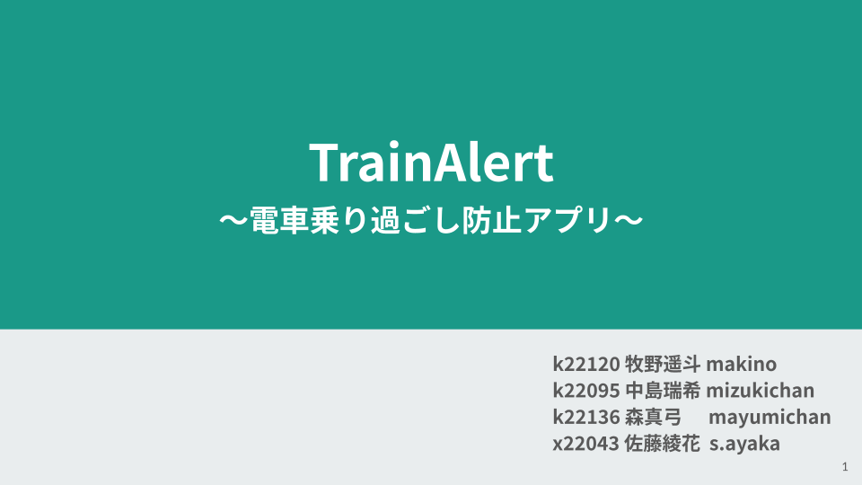
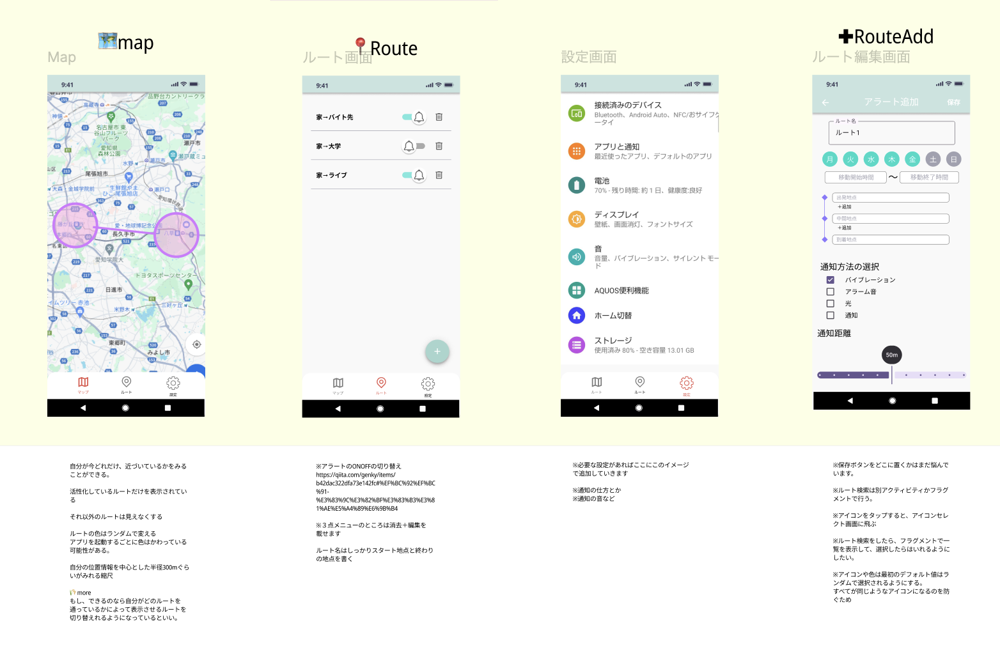

トレアラ(TrainAlert)
===

# 発表資料

画像をクリックするとGoogleSlideのサイトに飛びます
<a href="https://docs.google.com/presentation/d/1VmZ5MqhrQ4TsarSlLL7I6Yjs7zetDlh5msGu6t8NdqU/edit?usp=sharing">

</a>

# 概要
電車の乗り過ごしを防止するアプリケーション
位置推定、ジオフェンス、通知、Mapなどが使われる

# ユーザー定義
### 誰が
通勤・通学をする人

### 何をしたくて
電車に乗りながらよそごとを行いたい。
寝たい、ゲームしたい、話している、ぼーっとする

### どういった問題を抱えていて
誰も起こしてくれる人、教えてくれる人がいなく、乗り過ごしてしまう

### どのように解決するか？
スマートフォンで自動で降りる駅を認識して、自動で通知を送ったりして、起こす

# 画面構成


Figmaで編集をして、画面の構成を行っています。
より詳しく確認したい場合は、下記URLへ
[Figmaリンク](https://www.figma.com/design/B0b9noRr9CvVVvRBqUUxy7/%E7%94%BB%E9%9D%A2%E8%A8%AD%E8%A8%88?node-id=0-1&node-type=canvas&t=e6uMphaYbA9ObFEg-0)

# ライブラリ一覧

- DB
  - Room
- Map
  - GoogleMap
- Location
  - FusedLocation

# ディレクトリ構成

今回はディレクトリ構成として、各画面ごとにフォルダーを分割しました。
各画面ごとにフォルダーを分割することによって、関係ないファイルを触ってコンフリクトを起きることを防いでいます。
できれば、各画面でファイルを作成するときは、しっかりと役割ごとでクラスやファイルが分割されているといいなと考えています。

## 基本となるディレクトリ

このプロジェクトを開いてすぐのフォルダーからの眺めを表示しています。
基本的には、HTMLで記述をしているだけなので、そこまでわかりにくい書き方にはなっていないはず。

``` 
.
├── README.md → このファイルです
├── ReadmeImages → Readmeを書くために使用した画像ファイルが入っています
└── app/
    └── src/
        └── main/
            ├── java/
            │   └── net.harutiro.trainalert2/
            │       ├── core → 一番最初に開かれる内容が書いています
            │       ├── futures → 一つ一つの画面に分かれて記述ができるように分けられています
            │       ├── ui.thema → 色情報やテーマ情報が入っています
            │       ├── Application.kt → アプリが起動して一番最初に読み込まれるものが書いてます。今回はRoomの関係
            │       └── MainActivity.kt → 一番最初に動くアクティビティ
            └── res → 文字、画像ファイル、色データなどが入ります
```

## coreのディレクトリ

coreは一番最初に表示されるindex.htmlを表示して、いろいろなページに飛ばすための機能が書かれている部分
詳しい説明はしませんが、ボトムナビゲーションを動作させるコードが書かれています。

```
core
├── entity → Dataクラス関係が入っています
├── presenter → 画面の要素を持っています
│   ├── component → 複数の画面で使うようなコンポーネントを置きます
│   ├── home
│   │   ├── component →　homeで使うためのcomponentを置きます
│   │   ├── HomeScreen.kt → homeの画面の表示関係を置きます
│   │   └── HomeViewModel.kt → homeのviewModelです
│   ├── map
│   │   ├── component →　mapで使うためのcomponentを置きます
│   │   ├── MapScreen.kt → mapの画面の表示関係を置きます
│   │   └── MapViewMode.kt → mapのviewModelです
│   └── MainPage.kt → BottomNavigationの見た目が入っています
├── router
│   └── MainRouter.kt → NavHostの動作がここでまとまっています
└── utils → 便利に使える関数やクラスを置いておきます。
```

## featuresのディレクトリ

ここは各画面ごとの動作が書かれています。
ここは結構大事なので、しっかりと確認してもらえると助かります。
適宜足らないと思ったら追加をしてもらっても大丈夫です。

```
features
├── map → map関係の動作が入ります
├── notification → 通知にまつわる動作が入ります
└── room → roomのDBをおきます、複数のDBをおくことを考慮しています。
    ├── favoriteDB → 自分が昔作ったDBをサンプルとしておいています。
    └── AppDatabase.kt → 複数のRoomを登録しておくためのやつ
```

### 各ディレクトリごとの中身のファイルの説明

- api
  - 実際に端末にあるAPIを叩くためのディレクトリ
- entity
  - DataClassの定義をするためのディレクトリ
- repository
  - APIで実装した動作を論理的に実装する部分
  - APIの実装に依存しない形で実装をするといい
  - APIで具体的に動作を書いて、RepositoryでAPIでもらった動作によって動きを変えるイメージ


